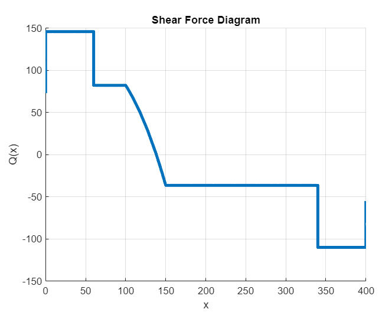
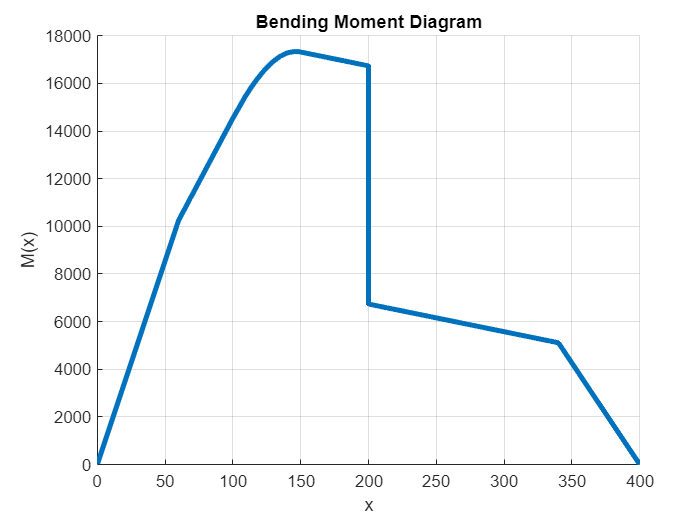
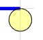
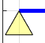
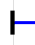
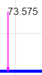
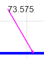
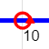
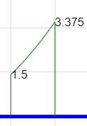

# Symbolic beam calculator for MATLAB
WORK IN PROGRESS

Documentation on how to use. It's recommended to **look at the given examples** since they are mostly self-explainatory. For still occouring questions you can look further into this documentation.
## Units
This beam-solver does not work with units! All units have to be the same and those are also the ones for the solution.
*Common Units are:*

||Force|Length|Torque|Lineload|
|:--:|:--:|:--:|:--:|:--:|
|**1**|N|mm|Nmm|N/mm|
|**2**|N|m|Nm|N/m|
|**3**|kN|m|kNm|kN/m|


## The Beam-Setup
First create a beam with a given length. The beam always is set to start at x = 0.
```Matlab
mybeam = beam(length);

% example:
mybeam = beam(10);
```
After setting up the beam add the bearings and external infuences. Those all need to be of their appropriate classes. To see how they are defined check the documentation further below.
```Matlab
mybeam.bearings = [Bearing_A, Bearing_B];
mybeam.pointloads = [F1, F2];
mybeam.torques = T1;
mybeam.lineloads = L1;
```
To empty for example all torques, just set it as an empty matrix:
```Matlab
mybeam.torques = [];
```

#### Numerical Replacements for Symbolics
If you use symbolic variables it's *strongly* recommended to have a numerical value for each symbol. This allows many functions to work which wouldn't otherwise. This has no infuence on the solution.

To have a substitute numerical value you have to give all symbolics (except for x) you use in a matrix (```symVars```) and all numerical substitutes (```numReplace```) as another one.

x is only allowed as symbolic when you refer to the position of the beam, for example in a lineload.

```Matlab
syms d d_2 m_T g
mybeam.symVars =    [d d_2 m_T g];
mybeam.numReplace = [4 2.2 15 9.81];
```


### Visualize Beam-Setup
To check if your beam-setup is as expected you can plot it before going on. The external influences in the plot are **not** to scale. This is to have always a consistant view and is better for checking if the forces etc. are in their correct places.
```Matlab
% do this to avoid problems (you can change the figure number)
figure(1); clf; hold on; grid on; axis equal;  % set figure
mybeam.plot_beam()  % plot into figure
```
## Solving
When your beam-setup is correct you can now solve the beam with the following command. With this all forces on the beam get calculated.
```Matlab
mybeam.fullsolve()  % this solves the beam
```
*This can take a while especially when you use symbolic variables.*

## Plotting results
[```symVars``` and ```numReplace``` must be set beforehand if you use symbolic variables. See [here](#Numerical-Replacements-for-Symbolics)]

Plotting shear force Q(x):
```Matlab
figure(2); clf; hold on; grid on;
mybeam.plot_Q()  % plotting shear forces
```


Plotting bending moment M(x):
```Matlab
figure(3); clf; hold on; grid on;
mybeam.plot_M()  % plotting bending moment
```



```Matlab

```

## External influences on beam
Here are all supported external influences described. (bearings, pointloads, torques, lineloads)
### Bearings
To create a bearing use:
```Matlab
Bearing_A = bearing(position, value, name);

% example:
Bearing_A = bearing(0, 2, 'A');
```
The position gives you the point on the beam. Have in mind, that the beam always starts at 0.
The Value describes what kind of bearing you like. There are three types (1, 2, 3)
**(1)**
 Can only take vertical forces
**(2)**
 Can take vertical and horizontal forces, but **no** torques
**(3)**
 Can take torques, vertical and horizontal forces

### Pointloads/Forces
A default pointload is defined vertically and is pushing on the beam from above. You can simply add it with two parameters:
```Matlab
F1 = pointload(position, value);

% example:
F1 = pointload(1.2, 73.575);
```

You can also add an angle to the given force. Note that the angle is measured from the positive x-direction. (counter clockwise is positive!)
```Matlab
F2 = pointload(position, value, angleDEG);  % angle in degrees

% example:
F2 = pointload(5.1, 73.575, 120);
```



### Torques
To create a torque use: (counter clockwise is positive!)
```Matlab
T1 = torque(position, value)

% example:
T1 = torque(3.3, 10);
```
In the visualization only the abolute value gets shown, and the turning direction is depicted with an arrow in the circle.


### Lineloads
It is possible to create a lineload with any custom function. If there is a dependency on the beamposition (x) just create a symbolic variable x. 
```Matlab
syms x
```
***In any other case using x as a symbolic is not allowed!***

To define the lineload you have to set the starting and ending position. The last parameter is the function of the lineload. This can also just be a number and does not need to be dependent on the beamposition.
```Matlab
lineLoad_1 = lineload(startPos, endPos, loadFunc)

% example:
L1 = lineload(2.5, 4.0, 0.15*x^2);
```



## Useful information

### Heaviside Function
The calculations are made with the heaviside function in MATLAB ([MATLAB dcumentation on the heaviside function](https://de.mathworks.com/help/symbolic/heaviside.html)). This allows to make one function for Q(x) and M(x) without having to split into different beamregions. It's good to understand the heaviside function to better interpret the symbolic solution.
